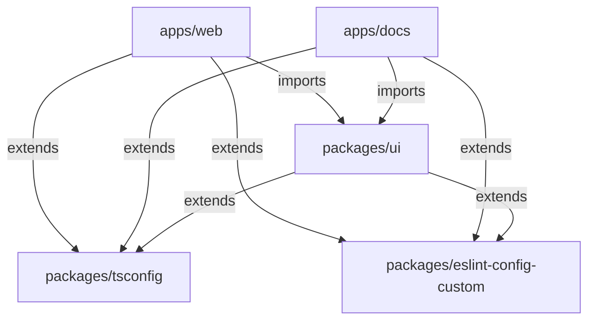

# Turborepo Example

A modern monorepo template built with Next.js 16, React 19, Tailwind CSS v4, TypeScript 5.9, Turborepo, and pnpm workspaces.

## Architecture



## What's Inside

### Apps

| App         | Description                           | Port |
| ----------- | ------------------------------------- | ---- |
| `apps/web`  | Next.js application with Tailwind CSS | 3000 |
| `apps/docs` | Nextra documentation site             | 3001 |

### Packages

| Package                         | Description                                                 |
| ------------------------------- | ----------------------------------------------------------- |
| `packages/ui`                   | Shared React component library (shadcn/ui, Radix, Tailwind) |
| `packages/tsconfig`             | Shared TypeScript configurations                            |
| `packages/eslint-config-custom` | Shared ESLint configuration                                 |

## Prerequisites

- [Node.js](https://nodejs.org/) >= 22
- [pnpm](https://pnpm.io/) >= 10

## Getting Started

```bash
git clone https://github.com/owieth/turborepo-example.git
cd turborepo-example
pnpm install
pnpm dev
```

## Scripts

| Command         | Description                        |
| --------------- | ---------------------------------- |
| `pnpm dev`      | Start all apps in development mode |
| `pnpm build`    | Build all apps and packages        |
| `pnpm lint`     | Lint all apps and packages         |
| `pnpm clean`    | Clean all build outputs            |
| `pnpm prettier` | Format all files                   |

## Project Structure

```
turborepo-example/
  apps/
    web/                 Next.js application
    docs/                Nextra documentation
  packages/
    ui/                  Shared component library
    tsconfig/            TypeScript configurations
    eslint-config-custom/ ESLint shared config
  docs/                  GitHub Pages landing page
  turbo.json             Turborepo task orchestration
  pnpm-workspace.yaml    Workspace definition
```

## Tech Stack

- [Next.js 16](https://nextjs.org/) — React framework
- [React 19](https://react.dev/) — UI library
- [Tailwind CSS v4](https://tailwindcss.com/) — Utility-first CSS
- [TypeScript 5.9](https://www.typescriptlang.org/) — Type safety
- [Turborepo](https://turbo.build/) — Build orchestration
- [pnpm](https://pnpm.io/) — Package management
- [shadcn/ui](https://ui.shadcn.com/) — Component primitives
- [Nextra](https://nextra.site/) — Documentation framework

## License

MIT
